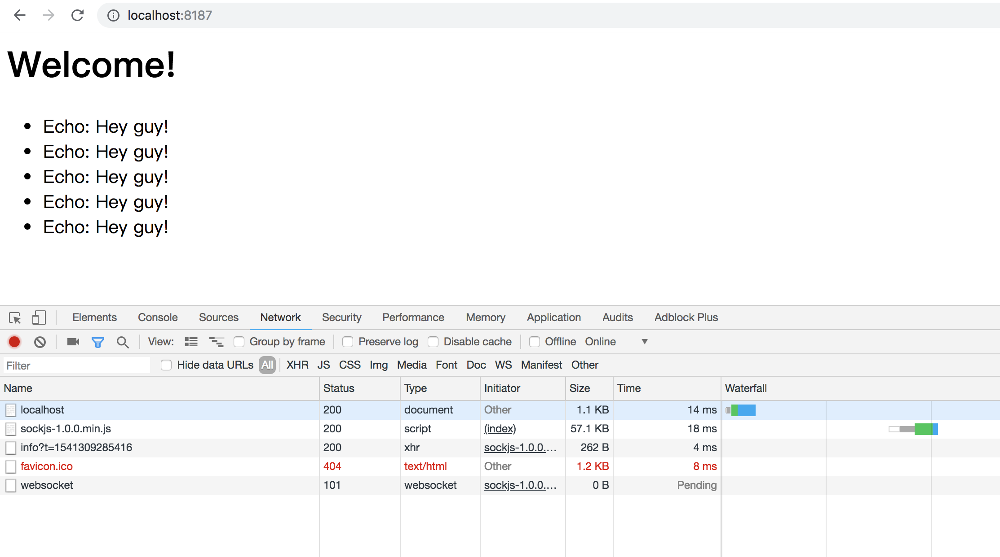
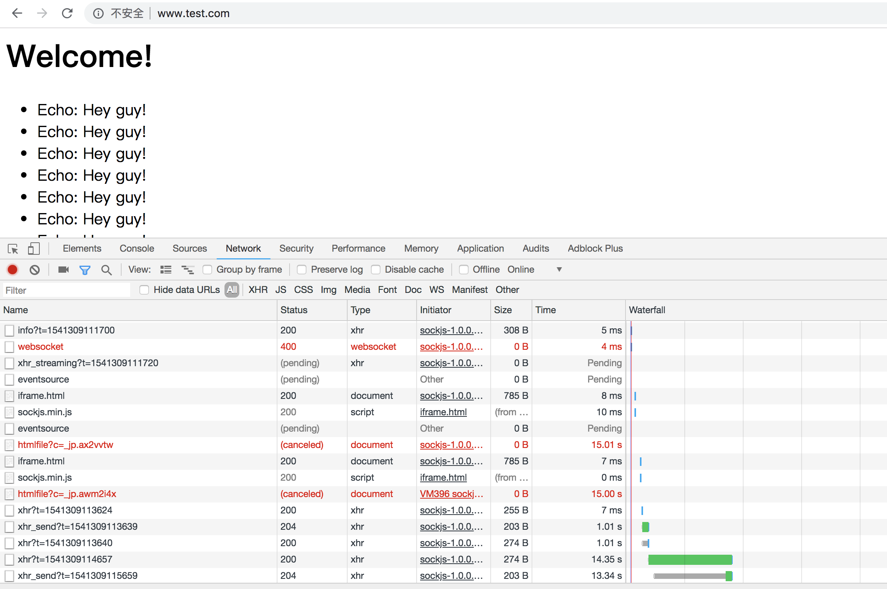

# Spring-ws

基于SpringMVC实现的支持SockJS的WebSocket工程实例

# 说明

本项目为maven项目，使用SpringMVC实现，用于展示如果使用 SockJS。项目启动后直接打开对应的端口在首页就可以看到展示的功能。

后端在"/echo"上添加了WebSocket处理器，它会在客户端传过来的消息前面加上 **"Echo:"** 然后传回去。

而页面会在打开的时候连接后端的WebSocket服务，连接之后每两秒发送一个 **"Hey guy!"** 的消息。

# 基于 SockJS 的 WebSocket 

在学习 **《Spring实战》** 第18章的时候才知道，原来在不支持WebSocket的情况下，也可以很简单地实现WebSocket的功能的，方法就是使用 [SockJS](https://github.com/sockjs/sockjs-client)。它会优先选择WebSocket进行连接，但是当服务器或客户端不支持WebSocket时，会自动在 XHR流、XDR流、iFrame事件源、iFrame HTML文件、XHR轮询、XDR轮询、iFrame XHR轮询、JSONP轮询 这几个方案中择优进行连接。

幸运的是，**我们不需要知道这些方案都代表什么，只需要简单地设置就可以使用了**。

## 服务端

在启动WebSocket的配置中，你需要做的所有事情就是加上 withSockJS()

```java
@Override
public void registerWebSocketHandlers(WebSocketHandlerRegistry webSocketHandlerRegistry) {
    // withSockJS 声明启用支持 sockJS
    webSocketHandlerRegistry.addHandler(echoHandler(), "/echo").withSockJS();
}
```

## 客户端

在客户端需要引入SockJS库，然后把 new WebSocket(url); 替换成 new SockJS(url); 

SockJS类和WebSocket类是兼容的，所以可以直接替换

```javascript
<script type="text/javascript" src="/resources/js/sockjs-1.0.0.min.js"></script>
var sock = new SockJS(url);
```

需要做的事情就是这么多

# 效果展示

## 支持WebSocket
当浏览器和服务器都支持 websocket 的时候，直接使用websocket连接



## 不支持WebSocket

不支持WebSocket的场景有：

1. 浏览器不支持
2. Web容器不支持，如tomcat7以前的版本不支持WebSocket
3. 防火墙不允许
4. Nginx没有开启WebSocket支持

当遇到不支持WebSocket的情况时，SockJS会尝试使用其他的方案来连接，刚开始打开的时候因为需要尝试各种方案，所以会阻塞一会儿，之后可以看到连接有异常，那就是尝试失败的情况。

为了测试，我使用Nginx做反向代理，把www.test.com指到项目启动的端口上，然后本地配HOST来达到模拟真实场景的效果。因为Nginx默认是不支持WebSocket的，所以这里模拟出了服务器不支持WebSocket的场景。


